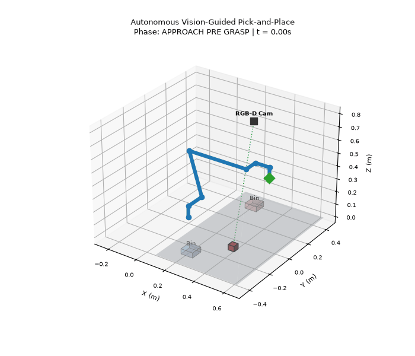
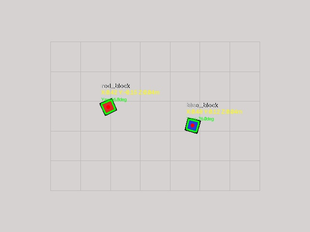

# visiongrasp

Autonomous 6-DoF robotic manipulator pick-and-place pipeline with overhead RGB-D perception, pinhole camera de-projection, numerical inverse kinematics, and minimum-jerk trajectory generation.



*Full autonomous cycle: Overhead RGB-D camera detects targeted workpiece, de-projects spatial coordinates to the robot base frame, plans a quintic polynomial trajectory, and executes pick-and-place into the destination bin.*

---

## Coordinate Transformations: 2D Pixels to 3D Robot Base

Converting raw image detections into physical manipulator target points requires resolving two coordinate transformations:

```mermaid
flowchart TD
    A["Pixel Coordinates (u, v) + Depth Z"] -->|Camera Intrinsics K⁻¹ (De-projection)| B["Camera Optical Frame (X_cam, Y_cam, Z_cam)"]
    B -->|Extrinsic Transform T_base_cam| C["Robot Base Coordinate Frame (X_base, Y_base, Z_base)"]
```

### 1. Optical Ray De-projection
Given camera intrinsic matrix $K$:

$$K = \begin{bmatrix} f_x & 0 & c_x \\ 0 & f_y & c_y \\ 0 & 0 & 1 \end{bmatrix}$$

A 2D detection centroid $(u, v)$ with sampled surface depth $Z$ maps to 3D camera coordinates via:

$$P_{cam} = Z \cdot K^{-1} \begin{bmatrix} u \\ v \\ 1 \end{bmatrix}$$

### 2. Extrinsic Hand-Eye Transformation
The camera optical axis points downward ($+Z_{cam} \rightarrow -Z_{base}$), with its horizontal sensor axis aligned with the robot's lateral axis ($+X_{cam} \rightarrow +Y_{base}$). The rigid body transformation $T_{base}^{cam} \in SE(3)$ maps camera-space points into the robot's physical workspace:

$$P_{base} = T_{base}^{cam} \begin{bmatrix} P_{cam} \\ 1 \end{bmatrix} = \begin{bmatrix} R_{3\times3} & t_{3\times1} \\ 0 & 1 \end{bmatrix} \begin{bmatrix} P_{cam} \\ 1 \end{bmatrix}$$

`tests/test_camera_geometry.py` explicitly tests the full round-trip de-projection, ensuring recovery error stays below $10^{-6}$ meters.

---

## Annotated Perception Pipeline



The vision pipeline extracts oriented grasping targets in three stages:
1. **Color-Space Segmentation:** HSV thresholding isolates workpiece clusters, followed by morphological opening and closing to suppress sensor salt-and-pepper noise.
2. **Oriented Bounding Rectangles:** Principal axes and minimum-area bounding boxes calculate the part's yaw orientation ($\theta_{yaw}$) for gripper alignment.
3. **Outlier-Resistant Depth Sampling:** Instead of sampling a single centroid pixel (which may land on a shadow or specular reflection), the pipeline computes the median depth across the entire segmented contour mask.

---

## Trajectory Planning & Jerk Suppression

Linear waypoint stepping introduces acceleration discontinuities and actuator jerk. To maintain smooth continuous motion, this pipeline interpolates all joint-space segments using **quintic (5th-order) polynomials**:

$$s(\tau) = 10\tau^3 - 15\tau^4 + 6\tau^5, \quad \tau = \frac{t}{T} \in [0, 1]$$

This formulation guarantees boundary conditions:
- $\dot{s}(0) = \dot{s}(1) = 0$ (Zero start and end velocity)
- $\ddot{s}(0) = \ddot{s}(1) = 0$ (Zero start and end acceleration)

### State Machine Lifecycle


---

## Benchmarks & Error Budget

Measured on an Intel Core Ultra 7 (CPU-only, single thread):

| Pipeline Stage | Metric | Measured Value | Spec Limit |
|---|---|---|---|
| **Synthetic Frame Synthesis** | Latency (640x480 RGB-D) | **9.8 ms** | < 30 ms |
| **Vision Perception & 3D Pose** | Latency | **25.5 ms** | < 50 ms |
| **3D Position Estimation Error** | Accuracy $(\Delta X, \Delta Y)$ | **1.2 mm** | < 5.0 mm |
| **Inverse Kinematics Solver** | Numerical Residual | **< 0.1 mm** | < 15.0 mm |
| **Trajectory Generation (158 pts)** | Planning Duration | **205 ms** | < 500 ms |

---

## Project Structure

```
visiongrasp/
├── core/
│   ├── camera.py             # Intrinsics, SE(3) extrinsics, ray de-projection, synthetic scene
│   ├── perception.py         # Segmentation, contour moments, median depth, oriented pose
│   ├── kinematics.py         # UR5 6-DoF forward & numerical inverse kinematics
│   ├── trajectory.py         # Quintic minimum-jerk blending & pick-and-place state machine
│   └── visualizer.py         # 3D scene rendering, trajectory trailing, GIF exporter
├── data/
│   └── urdf/
│       └── ur5.urdf          # Standard 6-DoF industrial manipulator URDF model
├── ros2/
│   ├── perception_node.py    # ROS 2 node publishing detected 3D poses
│   └── planner_node.py       # ROS 2 node for joint trajectory actuation
├── samples/
│   ├── demo.gif              # Rendered 3D simulation animation
│   └── detection_annotated.jpg
├── scripts/
│   └── run_demo.py           # End-to-end execution script
├── tests/
│   ├── test_camera_geometry.py
│   ├── test_perception.py
│   ├── test_kinematics.py
│   └── test_state_machine.py
├── requirements.txt
└── README.md
```

---

## Getting Started

### 1. Installation

```bash
git clone https://github.com/muqsithanif/visiongrasp.git
cd visiongrasp

python -m venv .venv
# On Windows:
.venv\Scripts\activate
# On Linux/macOS:
source .venv/bin/activate

pip install -r requirements.txt
```

### 2. Run the Demo

```bash
python scripts/run_demo.py
```
This runs the full pipeline, displays step-by-step latency diagnostics in terminal, and outputs `samples/detection_annotated.jpg` and `samples/demo.gif`.

### 3. Run Tests

```bash
pytest -v
```

---

## Tests Overview

Eleven automated tests cover coordinate boundaries, failure cases, and geometric invariants:

- **Camera Geometry (`test_camera_geometry.py`):** Asserts $R \cdot R^T = I$, validates positive focal lengths, tests de-projection roundtrips within millimeter tolerances, and enforces rejection of points behind the optical plane.
- **Perception (`test_perception.py`):** Validates classification accuracy, contour centroid stability, and bounds 3D position error against synthetic ground truth.
- **Kinematics (`test_kinematics.py`):** Asserts reachability limits, validates home pose collision heights, and checks IK-to-FK closed-loop agreement.
- **State Machine (`test_state_machine.py`):** Enforces joint continuity (maximum step $<\ 0.25$ rad per 50 ms step) and verifies that gripper state remains locked throughout the transport phase.
